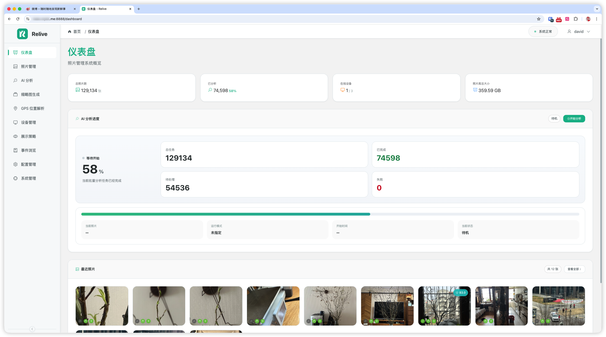
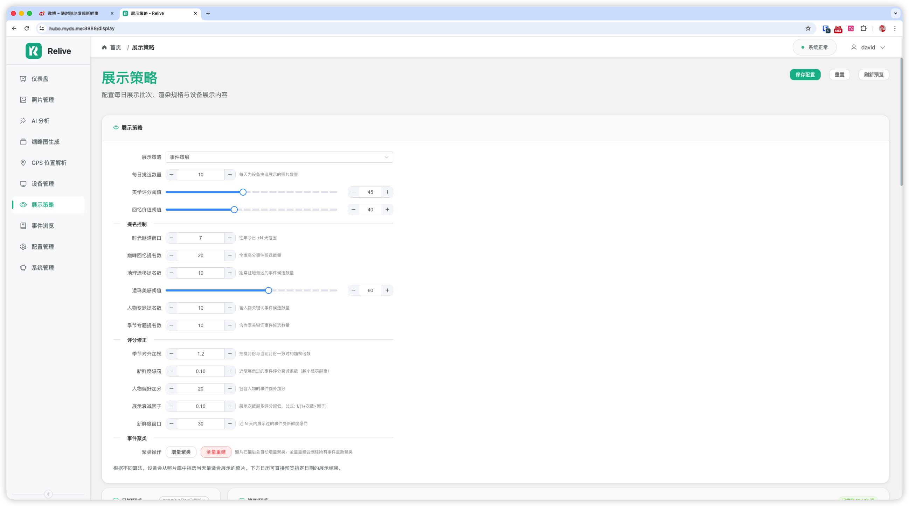
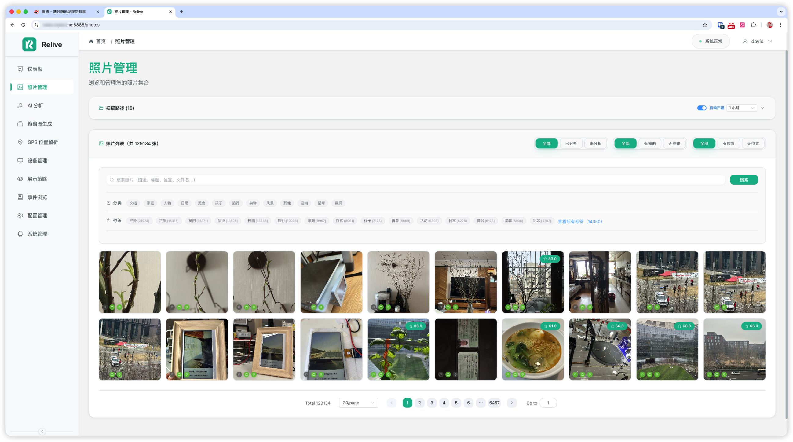
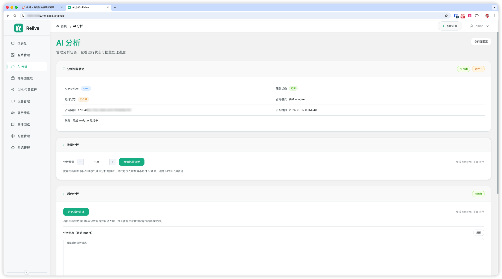
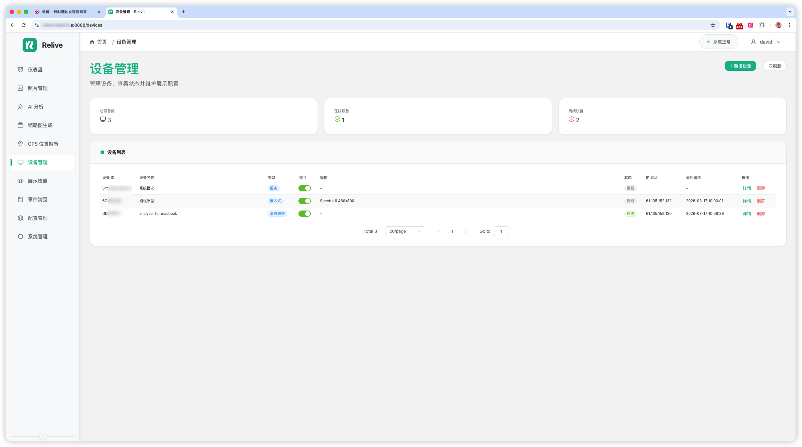
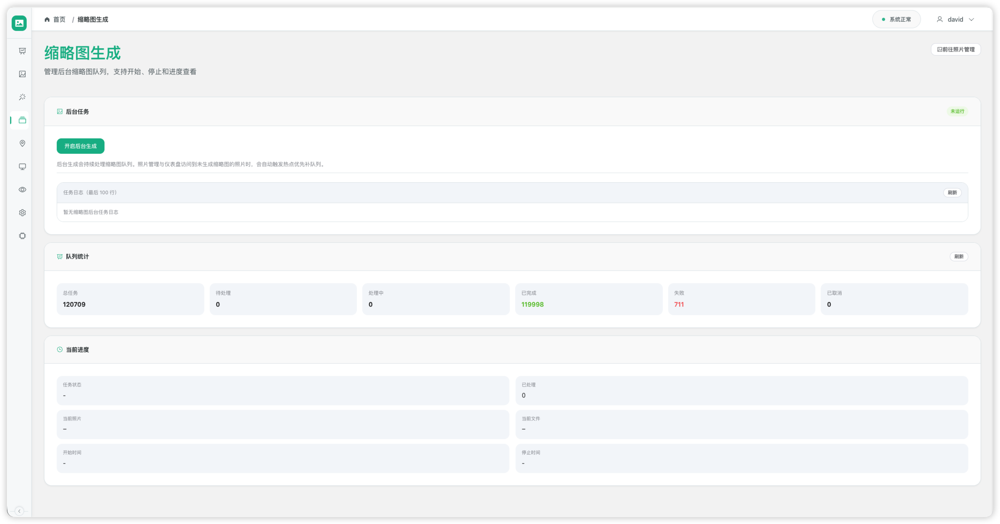
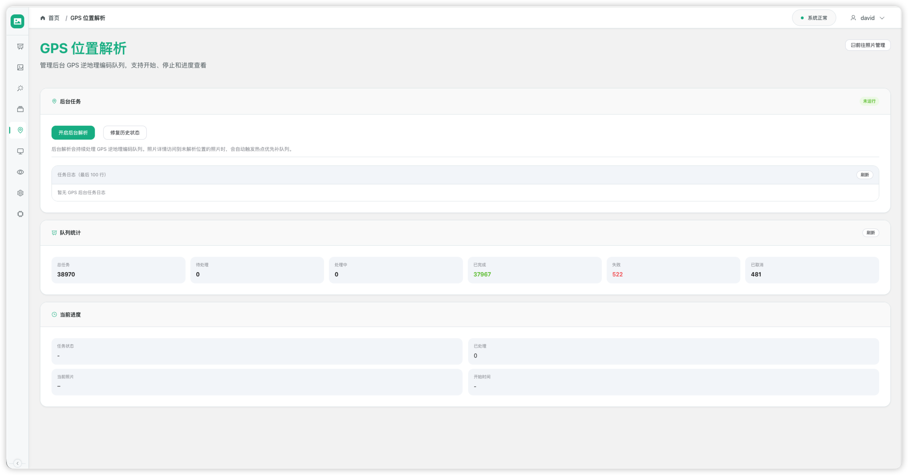
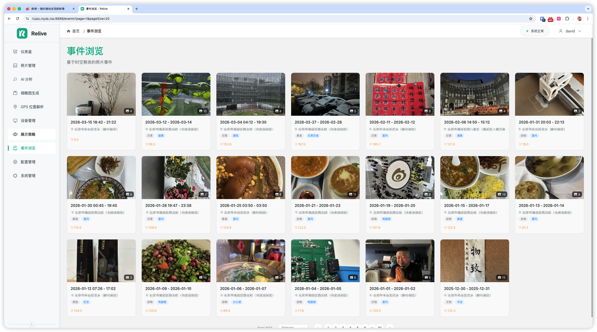
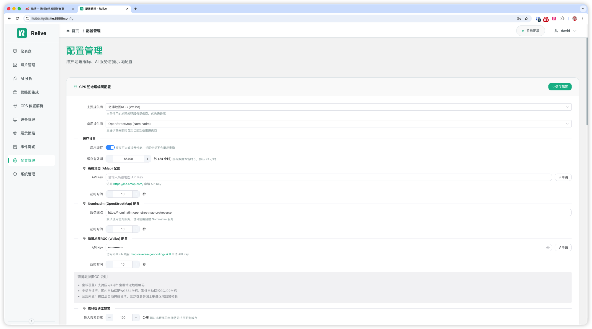
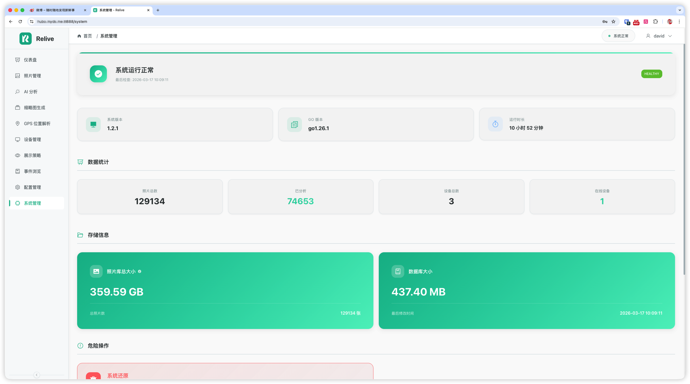

# Relive - 让照片重新活过来

[](https://opensource.org/licenses/MIT)
[]()
[]()
[]()
[]()
[]()
[]()
[](https://oshwhub.com/davidhoo/relive)

> 你的 NAS 里存了多少照片？它们上一次被翻看是什么时候？
> Relive 通过 AI 理解每张照片，以”往年今日”为线索，每天把值得重温的记忆送到你的相框上。


Relive 是一个自部署的照片回忆系统 —— 扫描你 NAS 中的照片，用 AI 理解内容，然后每天在相框或屏幕上呈现值得重温的瞬间。

它由六部分组成：
- **Web 管理后台**：扫描照片、配置 AI、管理设备和展示策略
- **后端服务**：处理照片分析、地理编码、缩略图生成等后台任务
- **ml-service**：人脸检测微服务（基于 InsightFace），自动识别照片中的人物并聚类
- **relive-analyzer**：独立的批量分析工具，适合在另一台 AI 主机上运行
- **relive-people-worker**：人脸检测 Worker，在 Mac M4 等高性能设备上运行，加速人脸检测
- **展示终端**：目前已支持 ESP32 墨水屏相框，未来可扩展到电脑屏保、移动端 App、微信小程序等
  - 🔧 硬件已开源：原理图、PCB、BOM 等均发布在 [立创开源硬件平台](https://oshwhub.com/davidhoo/relive)

---

## 为什么用 Relive

- **让照片不再只是”存着”**：围绕”往年今日”自动选图，每天重温不同年份的这一天
- **AI 真正理解照片内容**：不只是看 EXIF，而是理解场景、人物、氛围，给出评分和描述
- **支持多种 AI 部署方式**：本地模型、远程 GPU、云端 API，按需选择
- **NAS 与 AI 主机可以分开部署**：通过 `relive-analyzer` 在另一台机器上批量分析，通过 `relive-people-worker` 在 Mac M4 上加速人脸检测
- **认识照片里的人**：自动检测人脸、聚类归组，认出家人和朋友，让策展更有温度
- **完整的可视化管理**：扫描路径、AI 配置、设备管理、展示策略，全部在 Web 后台完成

## 适合谁

- 有大量家庭照片，想在日常生活中重新看到它们的人
- 用 NAS / Docker 自部署管理照片的人
- 想把照片分析和相框展示串起来的人

> Relive 需要 Docker 自部署环境，目前不提供云端托管服务。

## 当前状态

- ✅ Web 管理后台可用
- ✅ 后端 API 与任务系统可用
- ✅ `relive-analyzer` API 模式可用
- ✅ `relive-people-worker` 人脸检测 Worker（Mac M4 加速）
- ✅ 事件驱动型智能策展引擎（6 通道提名）
- ✅ 人物识别与管理（人脸检测、自动聚类、手动纠正）
- ✅ 照片级排除与手动旋转
- ✅ ESP32 墨水屏相框固件（AP 配网、定时睡眠、双配置源）

如果你只关心”现在能不能用”，答案是：**可以先从 Web + Docker 跑起来，再按需要接入 analyzer 或设备端。**

## 系统截图

<details>
<summary>点击展开截图</summary>

### 仪表盘


### 展示策略 - 往年今日选图


### 照片管理


### AI 分析


### 设备管理


### 缩略图生成


### GPS 位置解析


### 事件浏览


### 配置管理


### 系统管理


</details>

---

## 快速开始

最短路径如下：

### 1. 克隆仓库

```bash
git clone https://github.com/davidhoo/relive.git
cd relive
```

### 2. 准备已发布镜像部署文件

```bash
cp docker-compose.prod.yml.example docker-compose.prod.yml
cp .env.example .env
cp backend/config.prod.yaml.example backend/config.prod.yaml
```

建议至少修改：

```env
JWT_SECRET=replace-with-a-random-secret
```

### 3. 配置照片目录挂载

编辑 `docker-compose.prod.yml`，把宿主机照片目录挂到容器内：

```yaml
services:
  relive:
    volumes:
      - /your/photo/library:/app/photos:ro
```

### 4. 启动服务

```bash
make deploy-image
```

普通用户默认推荐这条路径：`make deploy-image` 会使用已发布镜像部署。

如果你是在本地修改代码、需要从源码构建镜像，请先执行 `cp docker-compose.yml.example docker-compose.yml`，再改用 `make deploy` 做源码部署。

### 5. 首次初始化

访问 `http://localhost:8080`，然后按这个顺序操作：
1. 使用默认账号 `admin / admin` 登录并修改密码
2. 到“配置管理”添加扫描路径，例如 `/app/photos`
3. 到“照片管理”执行扫描或重建
4. 如需 AI 分析，在“配置管理”中设置 AI Provider
5. 到“AI 分析”页面启动在线分析，或使用下方的 analyzer API 模式

更详细的部署说明：
- `QUICKSTART.md`：快速启动与部署
- `docs/CONFIGURATION.md`（配置职责与优先级）

---

## 使用方式

### 方式 1：直接在 Web 中扫描 + 在线分析

**适合：**
- 照片量不大
- AI 服务与 Relive 服务在同一网络内
- 你想直接在后台里完成全部操作

**基本流程：**
1. 添加扫描路径
2. 扫描照片
3. 配置 AI Provider
4. 在“AI 分析”页面启动分析
5. 在“照片管理”与“展示策略”中查看和使用结果

### 方式 2：使用 `relive-analyzer` API 模式批量分析

**适合：**
- 照片量大
- AI 主机与 NAS / 主服务分离
- 想把分析任务放到另一台更强的机器上执行

**基本流程：**
1. 在“设备管理”里创建 `offline` 或 `service` 类型设备
2. 复制生成的 `api_key`
3. `cp analyzer.yaml.example analyzer.yaml`
4. 填写 `server.endpoint` 与 `server.api_key`
5. 构建并运行 analyzer：

```bash
make build-analyzer
./backend/bin/relive-analyzer check -config analyzer.yaml
./backend/bin/relive-analyzer analyze -config analyzer.yaml
```

详细说明：`docs/ANALYZER_API_MODE.md`

---

## 核心能力

### AI 照片分析
- 理解照片内容、人物、场景和氛围
- 生成描述、短句、分类、标签与评分
- 支持 Ollama / vLLM / Qwen / OpenAI / Hybrid

### 人物识别与管理
- 基于 InsightFace 的人脸检测，自动从照片中提取人脸特征
- 向量相似度聚类，自动将同一人的照片归组
- 支持迭代式反馈驱动的重聚类，越用越准
- 人物管理界面：命名、合并、拆分、设置头像
- 照片详情页展示识别到的人物
- 人物亲密度自动融入策展引擎选图

### 往年今日 & 事件策展
- 每天自动挑选历史上同一天或相近日期的照片
- 事件驱动型智能策展：基于时空聚类的事件引擎，6 个提名通道（时光隧道 / 巅峰回忆 / 地理漂移 / 角落遗珠 / 人物专题 / 季节专题）
- 没有往年今日时，智能回溯到最近的历史记忆，确保每天都有内容
- 支持评分过滤，只展示值得回忆的照片

### 设备展示
- 支持 ESP32 墨水屏相框、Web 浏览器等多种展示终端
- 后台统一管理设备，自动推送当日展示内容
- 墨水屏相框支持 AP 配网、定时睡眠等低功耗特性

### ESP32 墨水屏相框

基于 ESP32-S3 + 7.3 寸 E Ink Spectra 6 彩色墨水屏的实体相框，每天定时从服务器获取"往年今日"照片并显示。

- **硬件**：ESP32-S3 + Good Display GDEP073E01 (800x480, 6 色)
- **配网**：首次使用自动进入 AP 配网（SSID: `relive`），Web 页面配置 WiFi、服务器、刷新时间
- **重新配置**：15 秒内连续按两次 Reset 键（或快速断电两次）重新进入配置页面，已有设置自动回显
- **低功耗**：定时深度睡眠，睡眠电流约 10μA，每天按设定时间点唤醒刷新
- **双模式**：Office 模式（编译时配置）与 NVS 模式（AP 配网配置）自动切换

详细说明见 [`devices/photo-frame/esp32/README.md`](devices/photo-frame/esp32/README.md)

### Web 管理后台
- 浏览照片和分析结果
- 人物管理：查看识别到的人物、命名、合并、设置头像
- 管理扫描路径、提示词、AI Provider、设备和展示策略
- 查看缩略图、地理编码、分析等后台任务状态

### 图片预处理与成本优化
- 分析前自动压缩图片
- 减少带宽与 API 成本
- 适合大规模照片库的批量处理场景

---

## 文档导航

### 当前使用
- `QUICKSTART.md`：快速启动与部署入口
- `docs/BACKEND_API.md`：当前已实现 API
- `docs/ANALYZER_API_MODE.md`：当前 analyzer API 模式
- `docs/PROJECT_STATUS.md`：当前项目状态

### 当前开发
- `docs/QUICK_REFERENCE.md`：开发速查卡
- `docs/CONFIGURATION.md`：配置职责与优先级
- `docs/DEVICE_PROTOCOL.md`：设备协议设计
- `docs/plans/event-driven-curation.md`：事件策展方案

### 历史文档
- `docs/INDEX.md`：完整文档导航
- `docs/ANALYZER.md`：旧版文件模式说明（历史）
- `docs/OFFLINE_WORKFLOW.md`：早期离线工作流设计（历史）
- `docs/API_DESIGN.md`：设计阶段 API 方案
- `docs/archive/ARCHITECTURE.md`：系统架构（设计阶段）
- `docs/archive/DEVELOPMENT.md`：开发说明（设计阶段）
- `docs/archive/DEPLOYMENT.md`：部署指南（设计阶段）
- `docs/archive/AI_PROVIDERS.md`：AI Provider 架构（设计阶段）
- `docs/archive/ANALYZER_PHASE1_DONE.md`：Analyzer Phase 1 完成总结
- `docs/archive/ANALYZER_TEST_REPORT.md`：Analyzer 测试报告

---

## Roadmap

- 支持更多展示终端（Android、iOS）
- 支持更多 AI Provider（Google Gemini 等）

## 致谢

- [InkTime](https://github.com/dai-hongtao/InkTime) - 墨水屏相框的灵感来源，我们学习和参照了他的想法

## License

MIT
